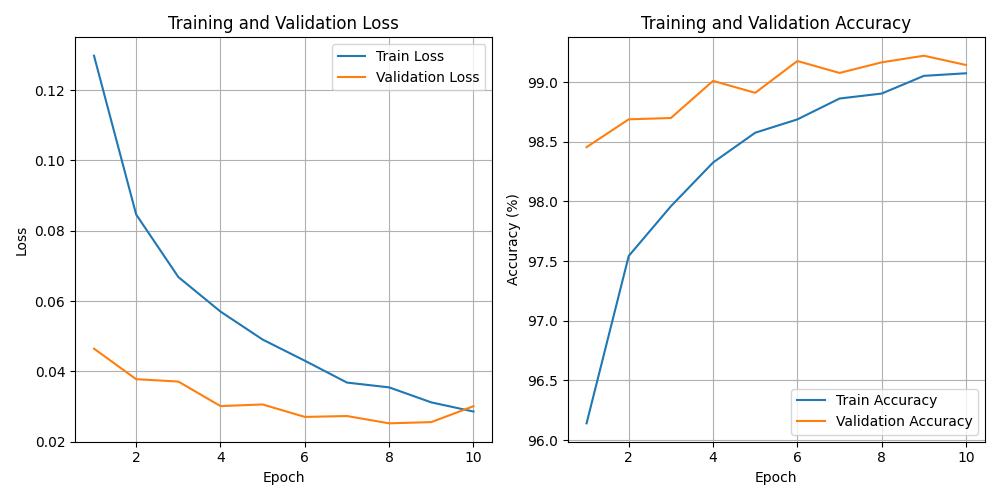
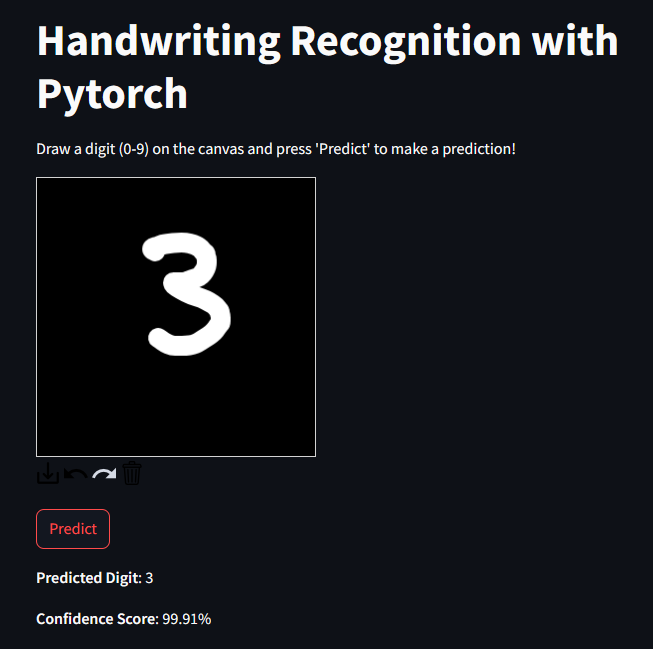

# MNIST Digit Recognition

This project implements a handwritten digit recognition system using PyTorch and Streamlit. It allows users to draw a digit (0-9) on a canvas via a web interface, and the app predicts the digit with a confidence score. The model is trained on the MNIST dataset using a convolutional neural network (ConvNet).

## Project Structure
- `app.py`: Streamlit application for interactive digit recognition.
- `train.ipynb`: Jupyter notebook containing the code to train the ConvNet model on the MNIST dataset.
- `mnist_training_plots.png`: Image showing the training and validation loss/accuracy plots.
- `requirements.txt`: List of Python dependencies required to run the project.
- `best_model.pth`: Pre-trained model file (not included in the repository due to size; see instructions below to obtain it).

## Model Evaluation
The following plots show the training and validation loss/accuracy over 10 epochs:


## Prerequisites
- Python 3.7 or higher
- Git (to clone the repository)
- A web browser to run the Streamlit app

## Setup Instructions
Follow these steps to set up and run the project on your local machine:

1. **Clone the Repository**:
   ```bash
   git clone https://github.com/Longnn28/mnist-digit-recognition.git
   cd mnist-digit-recognition
   ```

2. **Create a Virtual Environment** (optional but recommended):
   ```bash
   python -m venv venv
   source venv/bin/activate  # On Windows: venv\Scripts\activate
   ```

3. **Install Dependencies**:
   Install the required Python libraries listed in `requirements.txt`:
   ```bash
   pip install -r requirements.txt
   ```

## Running the Streamlit App
1. **Start the Streamlit Server**:
   ```bash
   streamlit run app.py
   ```

2. **Access the App**:
   - Open your browser and go to `http://localhost:8501`.
   - Draw a digit (0-9) on the canvas.
   - Click the "Predict" button to see the predicted digit and confidence score.
   - Click the "Clear Canvas" button to reset the canvas and draw a new digit.
